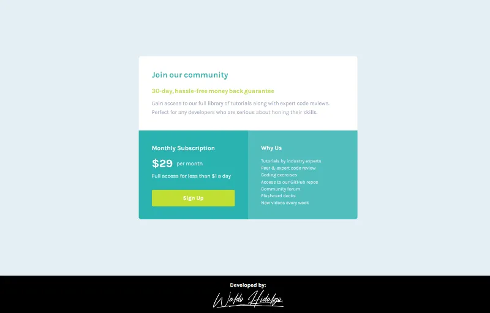

# Single price grid component

Repositorio con el código solución del challenge: [Single price grid component challenge on Frontend Mentor](https://www.frontendmentor.io/challenges/single-price-grid-component-5ce41129d0ff452fec5abbbc)

## Tabla de Contenidos

- [Single price grid component](#single-price-grid-component)
  - [Tabla de Contenidos](#tabla-de-contenidos)
  - [The challenge](#the-challenge)
  - [Diseño a Replicar](#diseño-a-replicar)
    - [1-Mobile Design](#1-mobile-design)
    - [2-Desktop Design](#2-desktop-design)
  - [Proyecto Realizado](#proyecto-realizado)
    - [1-Mobile Size](#1-mobile-size)
    - [2-Desktop Size](#2-desktop-size)
    - [3-Active State](#3-active-state)

## The challenge

El challenge consiste en realizar lo siguiente:

> Your users should be able to:
>
> - View the optimal layout for the component depending on their device's screen size
> - See a hover state on desktop for the Sign Up call-to-action

## Diseño a Replicar

### 1-Mobile Design

### 2-Desktop Design

## Proyecto Realizado

### 1-Mobile Size

### 2-Desktop Size

### 3-Active State

